# TicketBooking

A simple movie ticket booking system developed using Ruby on Rails.

- Login / Logout system (only normal users)
- Register system
- Buying Ticket system
- Inventory System

> This project is a part of final project for 2110497 (2021/1) Web dev with Ruby on Rails course at Faculty of Engineering, Department of Computer Engineering, Chulalongkorn University, Thailand.

## Installing

- Clone this repository to your local machine

```bash
  git clone https://github.com/jamestenni/ticketbooking.git
```

- To start the server, run the following command

```bash
  rails server
```

- Open your browser, navigate to

```bash
  localhost:3000/main
```

## Routes

#### User Routes

| Route            | Description                                                                              |
| :--------------- | :--------------------------------------------------------------------------------------- |
| /main            | for any users who want to view the now showing movie list                                |
| /login           | for old user who want to login to the system                                             |
| /register        | for new user who want to register                                                        |
| /inventory       | for the logged in user who want to view his/her purchased tickets                        |
| /movie/:movie_id | for any users who want to view the available showtimes of the movie whose id is movie_id |

#### Admin Routes

| Route       | Description                                      |
| :---------- | :----------------------------------------------- |
| /movies     | manage (add/edit/delete) the movies list         |
| /timetables | manage (add/edit/delete) movies’ timetables list |
| /theaters   | manage (add/edit/delete) the theaters list       |

## Preview

#### User Menu

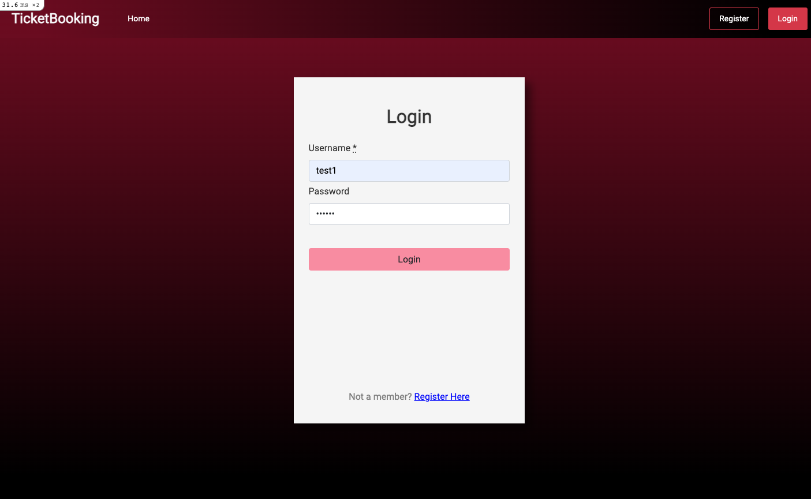

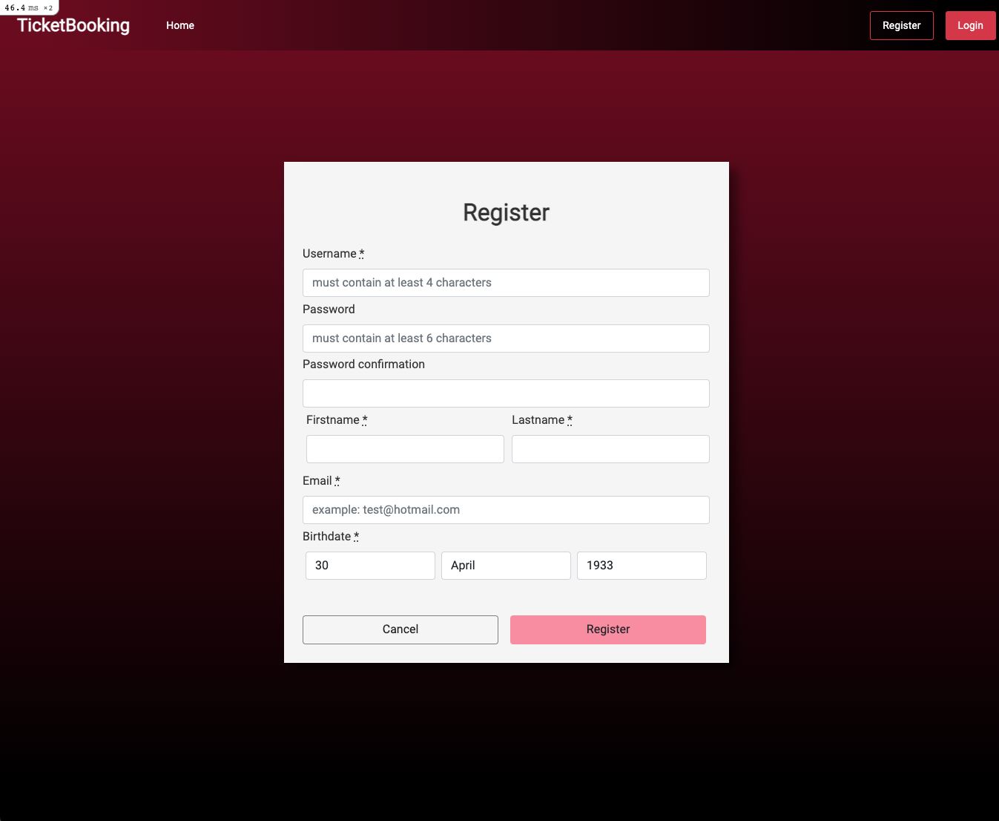

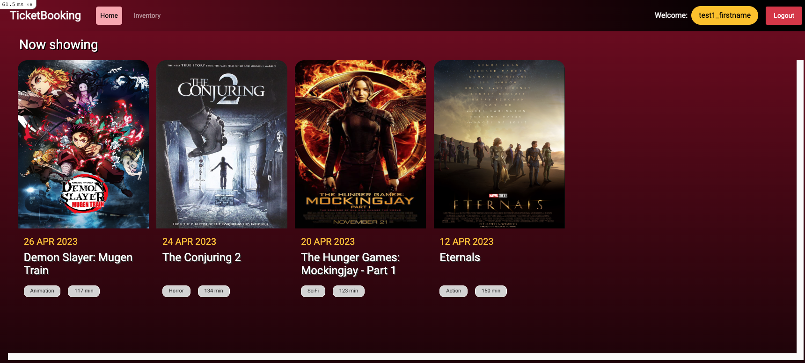

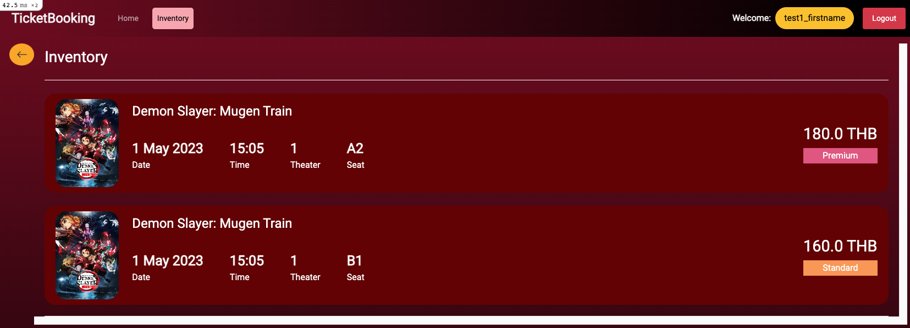

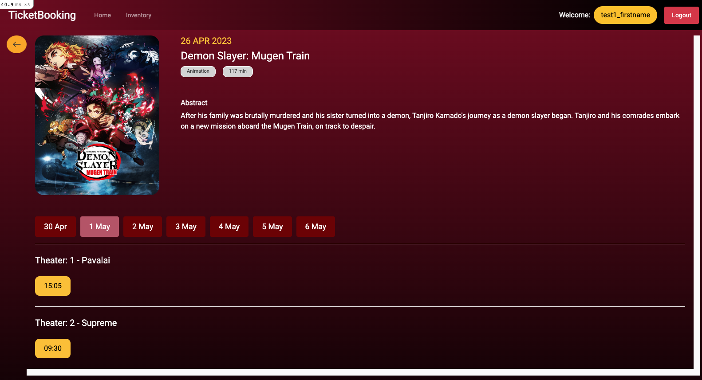

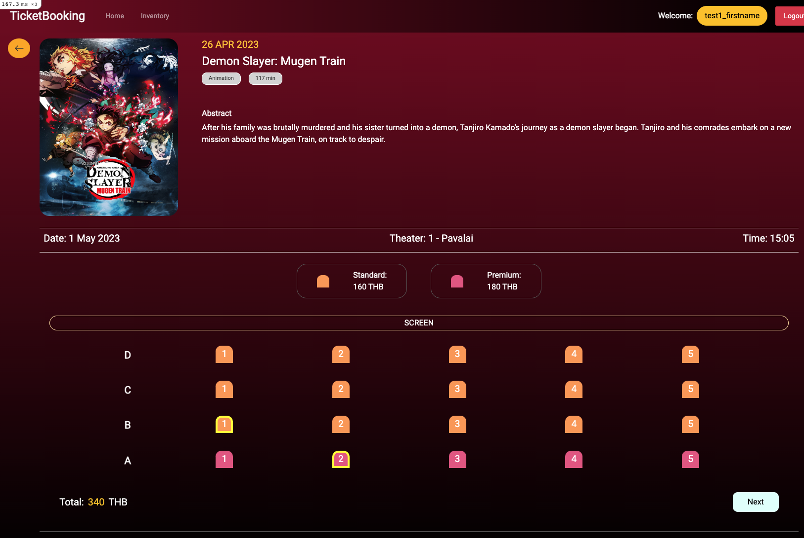

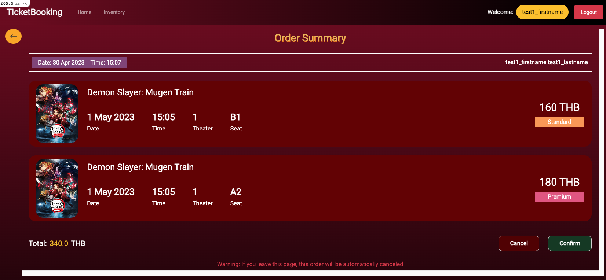

#### Admin Menu

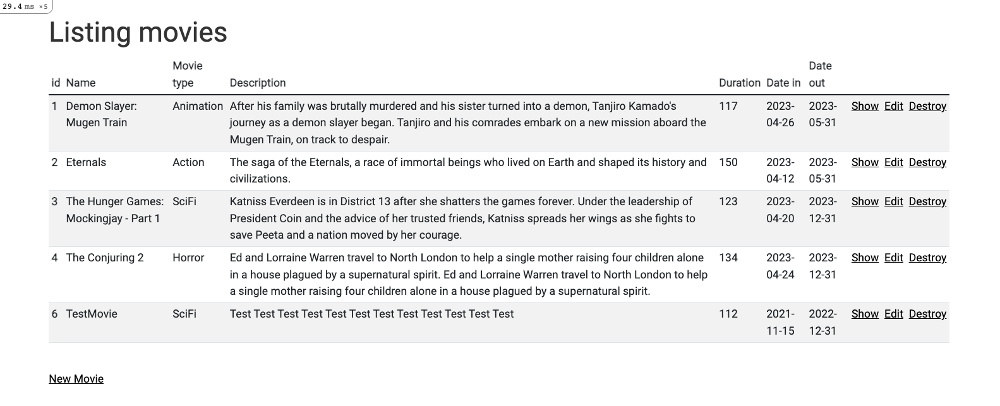

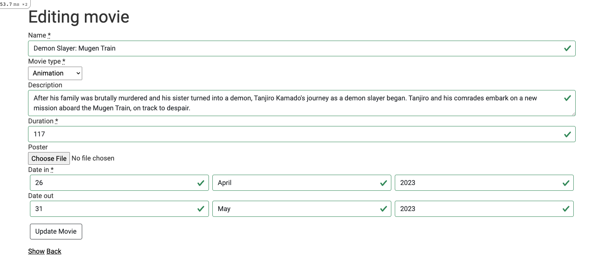

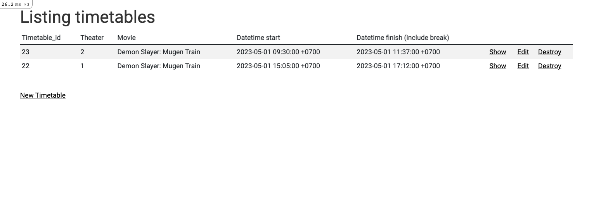

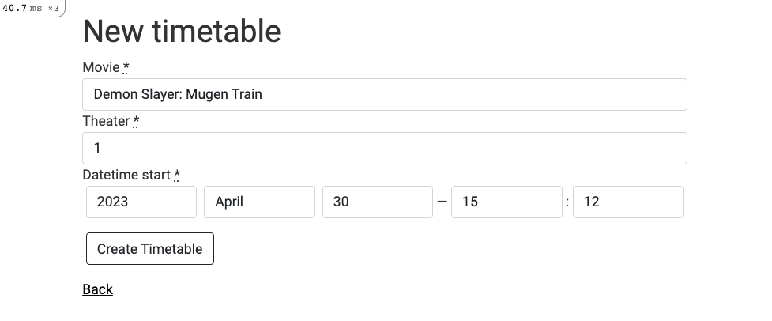

#### Model Diagram

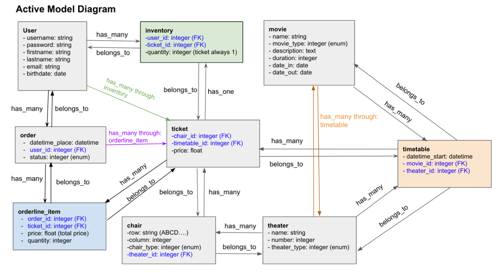
